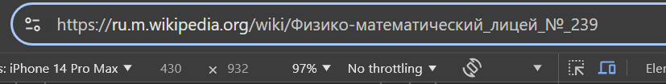

# Делаем запросики 

Мы сейчас поработаем с некоторой магией, пока магией, т.к. объяснение принципов работы протокола `http` - это дела будущего.

Как ваш браузер получает html страничку? Все до волшебного: он делает запрос (обычно не один) к серверу, на котором этот файлик хранится. Мы с вами сегодня поговорим как этот файй или что-то другое получить.

## Браузер

У любого браузера есть адресная строка, где пишется грубо говоря путь - место хранение фалов сайта.



Почему файлов? Если зайти во вкладку network, можно увидеть все обилие запросов, сделанных 
вашим браузером.


## Хочу быть как браузер

Вообще не только браузеры умеет такое

```Python
import requests

url = 'https://en.wikipedia.org/wiki/Saint_Petersburg_Lyceum_239'

response = requests.get(url)

print(response.text)

```

А вот и этот же запрос в браузере 


## requests

В Python для работы с HTTP-запросами используют библиотеку `requests`  из примера выше

### Основные составляющие HTTP-запроса
1. **URL** — адрес ресурса.
2. **Метод** — тип запроса (GET, POST, PUT и т.д.).
3. **Заголовки** — информация о запросе, например, `User-Agent` или `Content-Type`.
4. **Тело (Body)** — данные, передаваемые в запросе (чаще всего в POST-запросах).
5. **Параметры строки (Query Parameters)** — передаются в URL для фильтрации или других операций (например, `?page=2`).

### Примеры запросов с `requests`

#### GET-запрос

`GET` используется для получения данных.

```python
import requests

url = "https://ru.wikipedia.org/w/api.php"
params = {
    "action": "query",
    "list": "search",
    "srsearch": "239",
    "format": "json"
}

response = requests.get(url, params=params)

if response.status_code == 200:
    search_results = response.json()
    print(search_results)

```

Здесь `params` добавляет параметры в URL (`https://api.example.com/data?page=2`).

#### POST-запрос
`POST` используется для отправки данных на сервер.
```python
import requests
import json


url = "https://pelevin.gpt.dobro.ai/generate/"

msg = "Твой текст!"
data = {"prompt": msg}

response = requests.post(url, data=json.dumps(data)).json()
answer = response.get("replies")
print(*answer)
```


- `data` - принимает строку, поэтому 
    ```Python
  requests.post(url, data=json.dumps(data))
  ```
- `json` - принимает словарь, поэтому
     ```Python
      requests.post(url, json=data)
    ```
  

### Итог
- **GET** — для получения данных, `params` для параметров в URL.
- **POST** — для отправки данных, `data` или `json` для тела запроса.

## Задание

1. Написать функцию, получающую список `10` самых просматриваемых статей за день `X` и количество просмотров по ним 

Помощь:
```Python
import requests 
from datetime import datetime # Для работы со временем

day = (datetime(year=2024, month=9, day=1)).strftime('%Y/%m/%d')

url = f"https://wikimedia.org/api/rest_v1/metrics/pageviews/top/ru.wikipedia/all-access/{day}"

headers = {
    "User-Agent": "wiki agent" # Очень важно добавить этот заголовок к запросу, иначе wiki обидется 
}
```

Заголовки добавляются `.get(url, headers=... )`


2. Напишите функцию делающую запросы из 1 задания на промежуток времени 

```Python
start_date = '2024-10-01'
end_date = '2024-10-10'

def get_stats(start, end):
    # ваш код

get_stats(start_date, end_date)
```

Помощь:

Вот простая функция для получения списка дат 
```Python
from datetime import datetime, timedelta

def get_date_range(start_date, end_date):
    start = datetime.strptime(start_date, '%Y-%m-%d')
    end = datetime.strptime(end_date, '%Y-%m-%d')

    date_array = []
    current_date = start
    while current_date <= end:
        date_array.append(current_date.strftime('%Y-%m-%d'))
        current_date += timedelta(days=1)

    return date_array
```

Используйте ее

```Python
start_date = '2024-10-01'
end_date = '2024-10-10'

def get_stats(start, end):
    dates = get_date_range(start, end)
    # ваш код

get_stats(start_date, end_date)
```

3. Оберните предыдущую функцию в декоратор, считающий абсолютное время ее работы (как на прошлом занятии)
