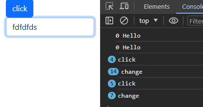
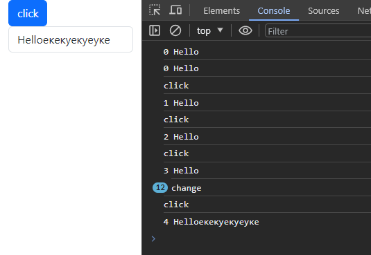

# Крестики-нолики

## Жизненный цикл компонента

Мы с вами говорили, что **React** строит виртуальное DOM (VDOM) дерево, позволяющее ему быстро и эффективно менять
"настоящее" DOM дерево, но не затрагивали как ведет себя компонент после создания VDOM. Каждый компонент имеет свой
жизненный цикл

### Фазы жизненного цикла:

#### 0. Инициализация 

Объявление всех компонентов, начальных состояний и т.д.

#### 1. Монтирование

Это фаза, на которой наш компонент React монтируется (то есть создается и вставляется) в DOM.
Эта фаза появляется на сцене после завершения инициализации. На этом этапе наш компонент рендерится в первый раз.

#### 2. Обновление

На это фазе компонент проживает все отведенное ему программистом время, тут же вызывается и перерисовка при изменении
состояний.

Хук **useState**, о котором мы говорили ранее, дает состояние, позволяющие изменять компонент в VDOM.

#### 3. Демонтированное

На этой фазе просто удаляется компонент из VDOM

## UseEffect

Неплохо было бы уметь отслеживать данные фазы. Например, имея компонент с анимацией, хотелось бы запускать ее только 
1 раз, а не при каждом обновлении.

С этим нам поможет хук **useEffect**

```jsx
useEffect(() => {}, []);
```

Он принимает на вход 2 аргумента: функцию - вызываемую при изменении состояния, массив состояний.
Последний аргумент необязателен. Давайте рассмотрим все более побробно


1. Не передаем массив состояний
```jsx

function Component() {
    const [count, setCount] = useState(0)
    const [text, setText] = useState("Hello")
    useEffect(() => {
       console.log(count + " " + text)
    });

    return <>
       <Button onClick={() => setCount(count+1)}/>click</Button>
       <Form.Control onChange={e => setText(e.target.value)} value={text}/>
    </>
}

```


useEffect сработал 2 раза из-за того, что мы в режиме разработчика, на самом деле после сборки он отработает 1 раз
при монтировании.

Напишем что-нибудь и покликаем.


useEffect отработал при каждом изменении состояний.

2. Передадим пустой массив состоящий

```jsx

function Component() {
    const [count, setCount] = useState(0)
    const [text, setText] = useState("Hello")
    useEffect(() => {
       console.log(count + " " + text)
    }, []);

    return <>
       <Button onClick={() => {
          console.log('click')
          setCount(count+1)
       }}/>
       <Form.Control onChange={e => {
          console.log('change')
           setText(e.target.value)
       }} value={text}/>
    </>
}

```

Мы добавили вывод в консоль при нажатии на кнопку и вводе.



**useEffect** отрабатывает только один раз

3. Добавим не пустой массив состояний

```jsx

function Component() {
    const [count, setCount] = useState(0)
    const [text, setText] = useState("Hello")
    useEffect(() => {
       console.log(count + " " + text)
    }, [count]);

    return <>
       <Button onClick={() => {
          console.log('click')
          setCount(count+1)
       }}/>
       <Form.Control onChange={e => {
          console.log('change')
           setText(e.target.value)
       }} value={text}/>
    </>
}

```



Теперь реагирует только на изменение переданной переменной состояния.

### Как случайно не убить браузер

useEffect 

В данном примере **useEffect** позволяет нам гарантировать, что при обновлении компонента все процессы, оставшиеся в
прошлых состояния работать уже не будут.

```jsx
function Component() {
   const [count, setCount] = useState(0)
   useEffect(() => {
      let timeout = setInterval(
          () => console.log(`Hi ${count}`), 1000)
   })
   return <>
      <p>{count}</p>
      <button onClick={() => setCount(count + 1)}>
         CLICK
      </button>
   </>
}
```
!!!живая демонстрация

Вот так нехитро мы наплодили кучу процессов, которые поедают память.

Решение заключается в том, что функция передаваемая useEffect, может вернуть функцию, которая вызовется после обновления

```jsx
function Component() {
   const [count, setCount] = useState(0)
   useEffect(() => {
      let timeout = setInterval(
          () => console.log(`Hi ${count}`), 1000)
      return () => clearTimeout(timeout)
   })
   return <>
      <p>{count}</p>
      <button onClick={() => setCount(count + 1)}>
         CLICK
      </button>
   </>
}
```

### Жизненный цикл в useEffect

```jsx
function Component() {
   const [count, setCount] = useState(1)

   useEffect(() => {
              console.log('mount')
              return () => console.log('unmount')
           }, []
   )

   useEffect(() => {
              console.log('update')
           }, [count]
   )

   return <div onClick={() => setCount(count+1)}>
      Hello
   </div>
}
```

### Пример с unmount

```jsx
function Exaple() {
   const [isMounted, setIsMounted] = useState(false)

   return <Container>
      <Button onClick={() => setIsMounted(!isMounted)}>
         {(isMounted ? "Убрать" : "Показать")}
      </Button>

      {(isMounted ? <Component/> : <div></div>)}
   </Container>
}

```


## Задание

Пишем с вами крестики-нолики.

1. Создать новый проект React. Посмотреть тут:
   <br>[Создаем проект.md](%D1%EE%E7%E4%E0%E5%EC%20%EF%F0%EE%E5%EA%F2)
2. Пишем компонент **Square** В ОТДЕЛЬНОМ ФАЙЛЕ (**Square.js**) с таким же именем, отображающий кнопку(button),
   он принимает значения: value -
   то, что написано на кнопке и функцию **onSquareClick**, вызываемую при нажатии на кнопку.

```jsx
function Square({value, onSquareClick}) {
    // ваш код
}
```

Можете для красоты использовать на кнопках написанный мною класс CSS или передать как объект стиля

Создать **Square.css**

```css
.square {
    font-size: 4em;
    min-width: 2em;
    min-height: 2em;
}
```

Импортировать в **Square.js**

```jsx
imoprt 'Square.css' 
```

Или

```jsx
const squareStyle = {
    fontSize: "4em",
    minWidth: "2em",
    minHeight: "2em"
}
```

```jsx
<button style={squareStyle}>...</button>
```

3. Пишем компонент **Board** В ОТДЕЛЬНОМ ФАЙЛЕ, он должен отрисовывать 3x3 компонентов **Square**.
4. Добавьте в **App** компонент **Board**. Что-то такое должно получиться:


5. Добавьте в **Board** два состояния: **squares** - массив, хранящий значение в клетке, и **hwoIsNext** - переменную,
   отвечающую за очередность ходов (используйте хук useState)

6. Добавьте в **Board** заголовок, показывающий - чей ход. Результат:


7. Напишите функцию **handleClick** в компоненте **Board**. Она должна отвечать за нажатие на **Square** (Подсказка:
   должна принимать индекс кнопки в массиве и изменять состояния)

8. Добавьте с помощью **useEffect** проверку на победителя. Если кто-то победил, поменяйте заголовок. как в примере:


Можно использовать следующую функции для проверки:

```jsx
function calculateWinner(squares) {
    const lines = [
        [0, 1, 2],
        [3, 4, 5],
        [6, 7, 8],
        [0, 3, 6],
        [1, 4, 7],
        [2, 5, 8],
        [0, 4, 8],
        [2, 4, 6],
    ];
    for (let i = 0; i < lines.length; i++) {
        const [a, b, c] = lines[i];
        if (squares[a] && squares[a] === squares[b] && squares[a] === squares[c]) {
            return squares[a];
        }
    }
    return null;
}
```

9. Если сделали предыдущее, то добавьте бота - соперника, ходящего, если в течение 5 секунд не сделан ход.
10. Сделайте компонент **Board** настраиваемым, т.е. в аргументах можно задать, размер n на m, придется переписать
    функцию проверки на победителя(((