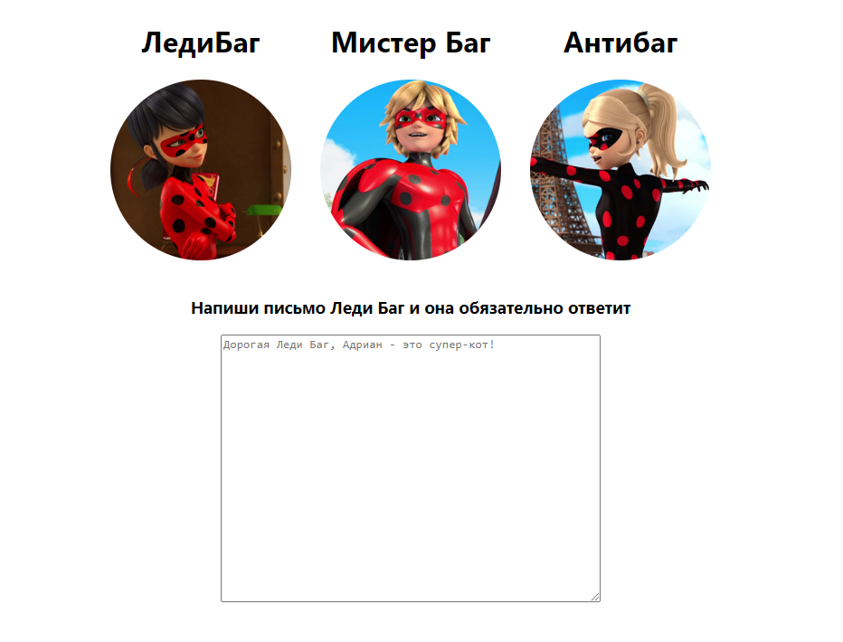

# "Hello, React!"

## JS + HTML

Зачем мы изучали js? В самом начале мы с вам говорили, что этот язык был придуман для придания web-странице
интерактивности. Собственно, js позволяет нам работать с DOM «Document Object Model» деревом, читать и редактировать
его.

```html
<!DOCTYPE html>
<html lang="en">
    <body>
        <div></div>
        <script src="test.js"></script>
    </body>
</html>
```

```js
console.log(document.body.children)
```


Но работать напрямую с DOM деревом с помощью голого js - это боль, а также очень опасно для ментального здоровья.
Естественно, программисты напридумывали кучу инструментов - библиотека, для упрощения своей жизни. Мы с вами
будем пользоваться **React**

## React

Конечно очень классно описывать отдельно структуру приложение и его функционал, но почему бы это не совместить. Великие
умы создали JSX.

> JSX — это расширение синтаксиса JavaScript, которое позволяет писать HTML-разметку внутри файла JavaScript.

<div style="display: flex; flex-flow: wrap;">
    
    
</div>

Грубо говоря, JSX позволяет создавать свои теги со встроенным функционалом.

<div style="display: flex;  flex-flow: wrap;">
    
    
</div>

Такие теги всегда пишутся с большой буквы - это очень важно, так тот кто будет собирать конечное DOM дерево (об этом мы
с вами поговорим позже) сможет отличить HTML-теги от наших.

### Что есть компонент?


Компонент - это обычная функция, которая возвращает разметку.

```jsx
function Component() {
  return (
      <button>I'm a button</button>
  );
}
```

Собственно, настало время поговорить про React. Это библиотека, в основу которой заложено, что пользовательский 
интерфейс состоит из блоков. Собственно эти блоки и есть наши компоненты. JSX != React, React зачастую используют с
JSX - это удобно. 

Давайте потрогаем компонент и посмотрим, что он умеет.
В React все страница - тоже компонент. Зачастую его называют App

```jsx
function App() {
  return (
    <h1>Hello</h1>
  );
}
```

Помните вам приходилось при изменении HTM или CSS, или JS файлов каждый раз обновлять страницу, React освобождает вас от
этого.

```jsx
function App() {
    return (
        <div>
            <h1>Hello</h1>
            "Mama"
            {"World"}
        </div>
    );
}

export default App;
```

{} - также, как и в строках позволяет вставлять выражения внутри разметки.

**export** - ключевое слово, позволяющее сделать объект видимым за пределами js файла

```jsx
function App() {
    const mother = "MAMA"
    const father = "PAPA"
    return (
        <div>
            <h1>Hello</h1>
            {(Math.random()> 0.5 ? mother : father)}
        </div>
    );
}

export default App;
```

Вернемся к Component

```jsx
function Component() {
    return (
        <button>I'm a button</button>
    );
}

function App() {
    return (
        <div>
            <h1>Hello</h1>
            {Component()}
            <Component/> // аналогичные записи, всегда используем как тег, повышая читабельность
        </div>
    );
}
export default App;
```


Если компонент - функция, то и аргументы может получать:

```jsx
function Component({name, onClick}) {
    return (
        <button onClick={onClick}>{name}</button>
    );
}

function App() {
    return (
        <div>
            <h1>Hello</h1>
            <Component name={"MAMA"} onClick={() => alert('PAPA')}/> 
        </div>
    );
}
export default App;
```

Обратите внимание **{name, onClick}** - единственный объект, получаемый компонентом, содержит аргументы

Добавим стиля.

```jsx
const componentStyle = {
    background: "red"
}

function Component({name, onClick}) {
    return (
        <button style={componentStyle} onClick={onClick}>{name}</button>
    );
}
```

componentStyle - объект, его можно передать в style вместо CSS класса.

### Попишем вместе

- Создать на React страницу с профилями.

```js
const persons = [{
    name: 'ЛедиБаг',
    imageUrl: 'https://miraculous.su/images/characters/ladybug_a.jpg',
    realName: "Маринетт"
}, {
    name: 'Мистер Баг',
    imageUrl: 'https://miraculous.su/images/characters/adrien_e.jpg',
    realName: "Адриан"
}, {
    name: 'Антибаг',
    imageUrl: 'https://miraculous.su/images/characters/chloe_d.jpg',
    realName: "Хлоя"
}];
```

Вот что должно получиться




### Пишете сами

- Создать на React страницу с профилями.


Можете использовать свои картинки и имена и свой текст. 

```js
const persons = [{
    name: 'ЛедиБаг', imageUrl: 'https://miraculous.su/images/characters/ladybug_a.jpg'
}, {
    name: 'АкваБаг', imageUrl: 'https://miraculous.su/images/characters/ladybug_b.jpg'
}, {
    name: 'Ледяная ЛедиБаг', imageUrl: 'https://miraculous.su/images/characters/ladybug_c.jpg'
}, {
    name: 'КосмоБаг', imageUrl: 'https://miraculous.su/images/characters/ladybug_d.jpg'
}, {
    name: 'ЛедиБаг', imageUrl: 'https://miraculous.su/images/characters/ladybug_a.jpg'
}, {
    name: 'АкваБаг', imageUrl: 'https://miraculous.su/images/characters/ladybug_b.jpg'
}, {
    name: 'Ледяная ЛедиБаг', imageUrl: 'https://miraculous.su/images/characters/ladybug_c.jpg'
}, {
    name: 'КосмоБаг', imageUrl: 'https://miraculous.su/images/characters/ladybug_d.jpg'
}];
```

Сделать с помощью бутстрапа магазин 

Пример:

