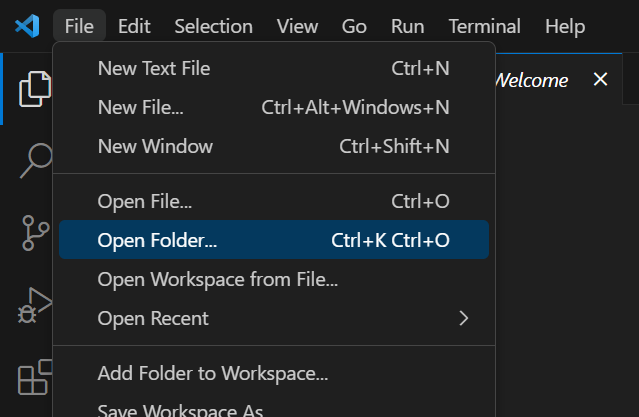
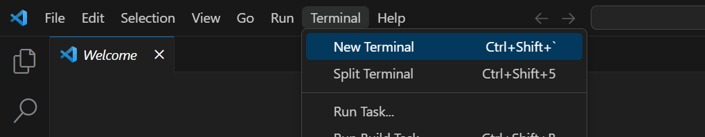
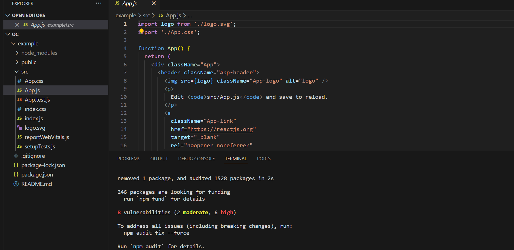
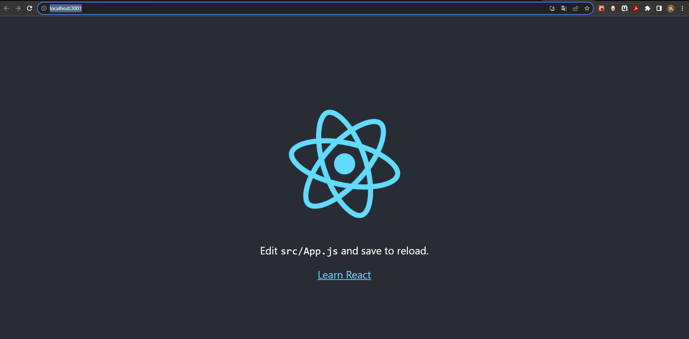

### Скачиваем Node.js
Node.js - интерпретатор js-а, как и браузер, только без интерфейса

https://nodejs.org/ru/download

После установки в VS code создаем новый проект



Открываем терминал



```
npx create-react-app example

```
Или, если npx не работает
```
npm install -g create-react-app
create-react-app my-app
```


Если все хорошо  

```
cd example
npm start
```

