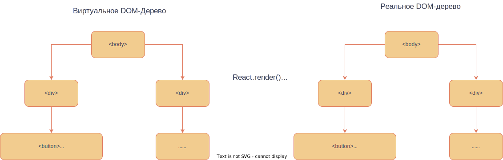

# Ху? Хуки

## Повторим

Еще раз, компонент - главная единица React. Компонент - функция.

```jsx
function MyComponent({name, url}) { // АРГУМЕНТЫ КОМПОНЕНТА {}
    // возвращаем jsx - особую смесь html и js
    return <>
        <h1>{name}</h1>
        
    </>
}
```

```jsx
<> - тоже самое что и <div> только короче и без параметров
```

Использование этого компонента будет выглядеть так:
```jsx
<div>
	<MyComponent name="some-name" url="https://test.com" />
</div>
```

Если хотим вставить выражение, переменную, функцию в jsx пишем все это в **{}**.

Компонент - тег собственного производства.

```jsx
function App() { // Главный компонент
	const myUrl = "https://test.com"
    return <>
        <MyComponent name={'Sasha'} url={myUrl}>
        </>
        }
```

Каждый "большой" компонент пишем в отдельном файле. Чтобы его можно было использовать в других файлах, компонент
надо экспортировать в собственном файле.

```jsx
export default MyComponent
```

И импортировать в нужном файле.

```jsx
import MyComponent from '.MyComponent.js'
```

Чтобы добавить css к компонентам, можно воспользоваться одним из двух способов:
1) Описать css в отдельном файле и импортировать его
```css
.my-component {
	backgroud: black
}
```

```jsx
import "./my-component.css"
function MyComponent({name, url}) {
    return <div className="my-component">
        <h1>{name}</h1>
        
    </div>
}
```

2) передать компоненту css как отдельный объект
```jsx
function MyComponent({name, url}) {
    return <div style = {{background: 'black'}}>
        <h1>{name}</h1>
        
    </div>
}
```

Полезно совмещать **map** и компоненты

```jsx
function MenuItem({title}) {
    return <li>
        {title + "  --->  "}
        <button>Заказать</button>
    </li>
}

function Menu({menuList}) {
    function getMenu() {
        if (!menuList || menuList.length === 0)
            return [
                "Шава ля классик",
                "Шава ля пармезано",
                "Шава ля педро де бебро"
            ]
        return menuList
    }

    return <>
        <ul>
            {getMenu().map((item) => <MenuItem title={item}/>)}
        </ul>
    </>
}

export default function App() {// Главный компонент
    return <Menu/>
}
```

<details><summary>Результат</summary>
    <div>
        <ul>
            <li>
                Шава ля классик ---> <button>Заказать</button>
            </li>
            <li>
                Шава ля пармезано ---> <button>Заказать</button>
            </li>
            <li>
                Шава ля педро де бебро ---> <button>Заказать</button>
            </li>
        </ul>
    </div>
</details>

## Наделяем жизнью

Все что мы сейчас умеем делать с React - это записывать html удобно через js. На первых занятияx по js, мы
отмечали, что этот прекрасный язык был придуман для "оживления сайта". Давайте этим и займемся. С чего начать?

Давайте попробуем создать кнопку, считающую количество кликов по ней.

```jsx
function Button() {
    let count = 0
    return <button>Меня переполняют клики {count}!</button>
}
```

У тега **button** есть атрибут **onClick**, исполняющий функцию, переданную этому атрибуту.

```jsx
function Button() {
    let count = 0

    return <button onClick={() => count++}>
        Меня переполняют клики {count}
    </button>
}
```

<details><summary>Результат</summary>
<button>Меня переполняют клики 0</button><br>
</details>

Почему это не работает?
## Немного про реакт изнутри

Как вы знаете, любая страница, открываемая в браузере - это HTML файл. Мы же, используя реакт пишем на какой-то смеси HTML и JS, почему это работает?

На самом деле, реакт преобразует этот "псевдоязык" (JSX) в обычный HTML, и делает он это в несколько этапов
1) Построение виртуального DOM дерева
2) Сравнение его с "реальным" и рендер не совпадающих частей

Рассмотрим на примере

Из JSX разметки реакт строит виртуальное DOM-дерево. Оно хранится в памяти JavaScript и нигде не отображается. В реакте есть функция `render()`, которая преобразует это виртуально дерево в реальное (реальное DOM-дерево = HTML код страницы, то есть это то, что мы видим). Один раз мы явно вызываем эту функцию (обычно в файле index.js)
```javascript
const root = ReactDOM.createRoot(document.getElementById('root'));
root.render(
  <React.StrictMode>
    <MyApp />
  </React.StrictMode>
);
```
В этот момент наш компонент `<MyApp/>` ( вместе со всеми его детьми, естественно) преобразуется в реальное DOM-дерево, поэтому мы видим не пустую страницу.
Однако после изменения нами значения `count` `render()` не вызывался, поэтому, не смотря на изменение виртуального дерева, реальное дерево останется нетронутым


Можно было бы руками вызывать `render()` после любого изменения, но это было бы не очень удобно, так что так делать **не нужно**, в реакте есть более элегантное решение, которым мы и будем пользоваться
### Хуки (пока что только useState)

Хуки — это функции, с помощью которых вы можете создать "отслеживаемую" переменную (реакт будет сам следить за всеми её изменениями и рендерить все компоненты, в которых она используется при её изменении)

```jsx
import {useState} from "react";

function Button() {
    const [count, setCount] = useState(0);

    return <button onClick={() => setCount(count + 1)}>
        Меня переполняют клики {count}
    </button>
}
```

Построчно разберем, что тут происходит

1. Импорт хука **useState**

```jsx
import {useState} from "react";
```

> **useState** — это React Hook, который позволяет добавлять переменную состояния в ваш компонент.

2. Вызов хука (передаем начальное состояние), useState(0) возвращает два объекта: **count** - саму переменную
   состояния, **setCount** - функцию для изменения **count**.

```jsx
const [count, setCount] = useState(0);
```

3. Передаем кнопке функцию, которая вызывает **setCount** с аргументом - новым значением **count**.

```jsx
<button onClick={() => setCount(count + 1)}>
```

Самое важное из всего этого - на все переменные, массивы, объекты, которые мы хотим как-то менять, надо повесить хук.

## Каждому ребенку по хуку (справа и слева)

Давайте оживим наше меню. При нажатии на кнопку <button>Заказать</button> ниже должен появляться сам заказ.

<details><summary>Референс</summary>
    <div>
        Меню
        <ul>
            <li>
                Шава ля классик ---> <button>Заказать</button>
            </li>
            <li>
                Шава ля пармезано ---> <button>Заказать</button>
            </li>
            <li>
                Шава ля педро де бебро ---> <button>Заказать</button>
            </li>
        </ul>
        Заказ: <br>
        Шава ля классик <br>
        Шава ля классик <br>
        Шава ля педро де бебро <br>
    </div>
</details>

```jsx
function MenuItem({title, onMenuItemClick}) {
    return <li>
        {title + "  --->  "}
        <button onClick={onMenuItemClick}>Заказать</button>
    </li>
}
```

```jsx
function Menu() {
    const [orders, setOrders] = useState([])
    const menuList = [
        "Шава ля классик",
        "Шава ля пармезано",
        "Шава ля педро де бебро"
    ]

    function handleOrders(item) {
        let newOrders = orders.slice()
        newOrders.push(item)
        setOrders(newOrders)
    }

    return <>
        Меню
        <ul>
            {menuList.map((item) =>
                <MenuItem
                    title={item}
                    onMenuItemClick={() => handleOrders(item)}
                />)}
        </ul>
        Заказ:
        {orders.map((order) => <div>{order}</div>)}
    </>
}
```

1. Добавим новую переменную состояния - **orders**. Начальное состояние - [].

```jsx
const [orders, setOrders] = useState([])
```

2. Также напишем новую функцию **handleOrders**, вызывающую изменение **orders** - **setOrders**
   с НОВЫМ массивом заказов. Обратите внимание, что переменная состояния всегда должна быть **const** - это
   гарантирует корректность работы React.

```jsx
function handleOrders(item) {
    let newOrders = orders.slice()
    newOrders.push(item)
    setOrders(newOrders)
}
```

3. Создаем меню, передаем компоненту **MenuItem** функцию, вызывающую **handleOrders** с аргументом, названием позиции в
   меню - **item**.

```jsx
<ul>
    {menuList.map((item) =>
        <MenuItem
            title={item}
            onMenuItemClick={() => handleOrders(item)}
        />)}
</ul>
```

4. Просто обрисовываем наши заказы

```jsx
{
    orders.map((order) => <div>{order}</div>)
}
```

5. Не забываем про импорты и экспорты.

### Условное отображение
Часто нам может хотеться отображать какой-то элемент только при определенном условии, как это можно сделать, используя то, что мы уже умеем?

К сожалению, через просто `if else` не получится, так что вспомним про существование тернарного оператора
```jsx
function ConditionalRender({showSomething}) {
    return <>
	    {showSomething 
		? <p>something</p>
	    : <p>No something for you :(( </p>}
    </>
}
```

### Обработка событий
Мы уже использовали `onClick` для обработки нажатия на кнопку, но на самом деле, событий гораздо больше. Часто вам может понадобиться получать значение из инпута, как это можно сделать с помощью событий?
```jsx
function Events() {
	const [input, setInput] = useState("")
    return <>
		<input value={input} onInput={e => setInput(e.target.value)}/>
    </>
}
```
Теперь в переменной input всегда лежит значение из инпута
## Задание
1) создайте компонент, который состоит из инпута и кнопки, при нажатии на которую вызывается `alert()` со значением из инпута
2) создайте компонент, состоящий из инпута и `<p></p>`, текст в котором всегда совпадает со введенным в инпут
3) создайте компонент [модальное окно](https://react-bootstrap.netlify.app/docs/components/modal/). Теперь в компоненте из первого задания вместо `alert()` используйте это модальное окно для отображения текста инпута
4) создайте "список пользователей" - компонент, хранящий в себе массив имён (и как-то их отображающий на экране). Если массив пользователей пустой, выводите на экран надпись "пользователей пока нет"  Создайте ещё один компонент с инпутом и кнопкой, при нажатии на которую "пользователь" (имя из инпута) добавляется в "список" (при этом из инпута значение должно исчезнуть)
5) Теперь для каждого пользователя добавьте кнопку "удалить", которая удаляет его из списка
6) При удалении добавьте модальное окно с подтверждением удаления