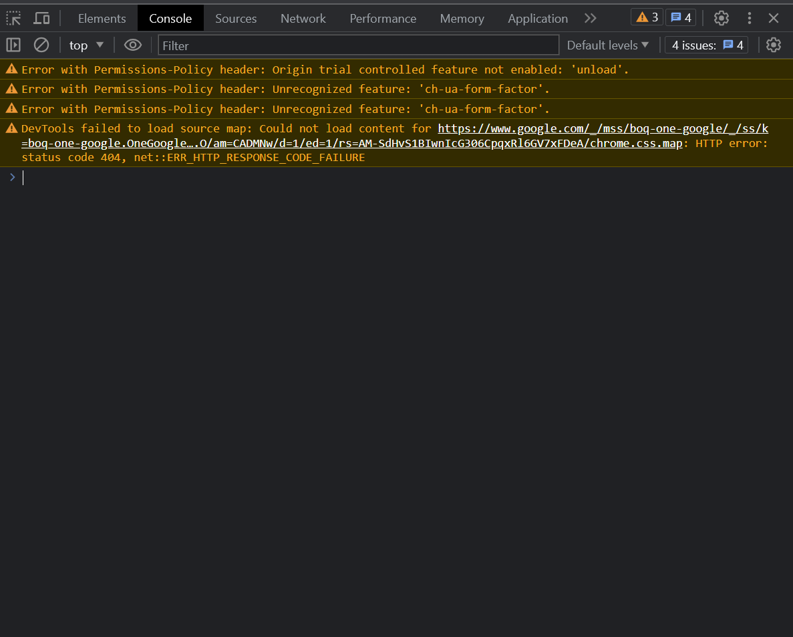
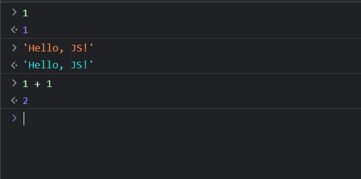

# Как что-то написать?

Перед изучением самого языка давайте поговорим немного, где он "запускается".

## Запуск в консоли браузера

1. Ctrl + Shift + i

2. Простой ввод и вывод


## Запуск через загрузку html-документа

1. \<script>
```html
<!DOCTYPE html>
<html lang="en">
<head>
    <title>Title</title>
</head>
<body>
<div>Hello, JS!</div>
</body>
<script>
    console.log("Hello, here too, JS!")
</script>
</html>
```
Пример [script_tag.html](working_materials/script_tag.html)
2. Отдельный скриптовый файл
```html
<script src="separate_file.js"></script>
```
Пример [script_link.html](working_materials/script_link.html)