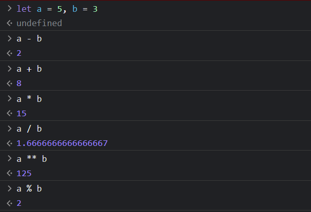
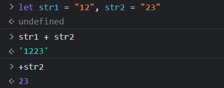
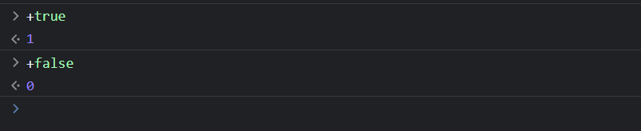
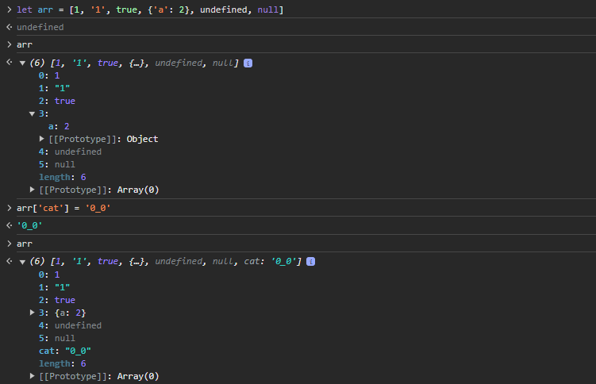

# Сразу к делу, сразу к синтаксису!

## Переменные 

В JS для объявления переменной используются ключевые слова: 

```js
let needfullKeyword = "let — директива или ключевое слово для объявления локальной переменной"
const usefullKeyword = "const — ключевое слово для объявления константы"
var uselessKeyword = "var — устаревшая деректива, выполняющая в современном JS такую же роль как и let"
```

Оператор присваивания — знак равенства.

## Типизация, ой!

JavaScript — язык программирования с динамической типизацией (как и Python), т.е. в нем нет строгих типов переменных, известных на этапе компиляции, как в Java.

```js
let cat = "(´｡• ω •｡`)"
cat = 2023
cat = 3.1415926
cat = true
cat = null
cat = undefined
cat = ["paw", "paw", "paw", "paw", "head", "tail"]
cat = {
    "name": "",
    age: 13,
}
cat = () => console.log("._.")
cat = function (name) {
    return {"name": name}
}
```

Выглядит страшно, давайте разбираться по порядку.
### Числа

В JS всего два числовых типа — *number* и *BigInt*:

- **number**

Безопасно работает с ****вещественными**** числами в диапазоне от *-(2^53 - 1)* до *2^53 - 1*.

```js
cat = 2023
cat = 3.1415926
```

- **BigInt**

Работает с целыми числами произвольной длины.
Чтобы создать значение типа BigInt, необходимо добавить n в конец числового литерала:

```js
const cat = 12345678987655123456789098765432123456789598765432n
```

На практике такие числа нужны довольно редко.

Предлагаю сразу здесь поговорить об операндах применяемых к **number**:



Обратите внимание, что задание переменных можно лаконично писать через запятую.

- **+-Infinity, 0 и NaN**

```js
let a = 0 ** 0
b = 1 / 0
c = (-1) ** 0.5 
d = c * a * b
```

### Строки (string)

```js
let str = "Hello, JS!"
str = 'Hello, JS!'

let js = 'JS'
str = `Hello, ${js}!` // 'Hello, JS!'
```

В JS строки задаются с помощью кавычек трех видов, Двойные или одинарные кавычки являются «простыми», между ними нет 
разницы. Обратные же кавычки (\`) позволяют вставлять в себя целые переменные, выражения.

```js
let a = 3
let b = 10
let expression = `${a} + ${b} = ${a+b}` // '3 + 10 = 13'
```

Операции со строками:



Простой способ привести строку к числу — поставить передней +.

```js
let a = "ABC"
let b = a * a // ?
```

Длина строки, да проще простого.

```js
let str = "123456789"
let len = str.length // 9
```

### Логический тип (boolean)

```js
let statement = true
statement = false
```

Тип данных boolean имеет всего 2 значения (true/false)



Логические операции:

- && — логическое умножение (and)
- || — логическое сложение (or)
- ! — отрицание

```js
let bool1 = false && true // true
let bool2 = false || true // true
let bool3 = !true // false
let bool4 = !'aaa' // ?
let bool5 = !'0' // ?
```

Операторы сравнения:

- \> (больше)
- \< (меньше)
- \>= (больше-равно)
- \<= (меньше-равно)
- == (равенство)
- === (строгое равенство)

```js
2 > 1 // true

'1' == 1 // ?
'1' === 1 // ?
true == 1 // ?
'ABC' >= 'BCD' // ?
```

### typeof

Оператор **typeof** возвращает тип аргумента.

```js
typeof '1' // 'number'
typeof 1 // 'string'
typeof(true) // ?

typeof(NaN) // ?
typeof Infinity // ?
typeof(1 + '0') // ?
typeof +('0' + 1) // ?
```

### Великий и всеобъемлющий object

Все рассмотренные выше типы данных — примитивы. 

> Чаще всего значение примитивного типа представлено в низкоуровневой реализации языка.

За исключением 2 типов, о которых мы поговорим далее, все примитивы имеют объектный аналог,
оборачивающий значение примитивного типа:

- String
- Number
- BigInt
- Boolean

```js
let a = new Number(1)
let b = 1
typeof a // 'number'
a == b // ?
Number('1') // ?

a === b // ?
```

Уже несколько раз мы упомянули объект, собственно, а что это?

Если заходить из далека, то программисту, очевидно не достаточно примитивов для удобного написания кода.
Представим ситуацию, Вам на сайте в таблице надо отобразить данные всех пользователей, как их хранить внутри кода?
Не заведешь же под каждого пользователя и его параметров по переменной?

В глобальном смысле object решает данную проблему (массив в js это тоже object, если чуть глубже то его потомок)

```js
let obj = new Object() // уже упомянутое ключевое слово new — создает экземпляр объекта.
typeof obj // 'object'
Boolean(obj) // true

obj.param = '0_0'

obj // {param: '0_0'} — что-то на питоновском?>
obj.param // '0_0'
```
Через точку можно задать параметр объекта, **param** — называется ключом (он уникален), то, что мы положили — значение. 
Пара ключ-значение — свойство объекта, собственно, **object** и определяется **свойствами**.
Есть и более удобная и лаконичная запись создания объекта.

```js
let family = {
    parent1: 'mather',
    parent2: 'father',
    capital: 300,
    haveKids: false,
}
```

Значениями могут быть не только примитивы.

```js
family.parent1 = {'name': 'Ненси', 'age': 32}
family['parent2'] = {'name': 'Сид', 'age': 20}
```

Обратите внимание на 2 вещи. Во-первых, Ключ — это строка и только строка. 

```js
> {{a: 1}: 12} // Uncaught SyntaxError: Unexpected token ':'
```
Во-вторых, задать свойство объекта (или обратиться к нему) можно через квадратные скобки и ключ.

- **undefined**

Что произойдет если мы обратимся к несуществующему свойству.

```js
family.grandparents // ?
let a
a // ?
```

Еще один примитив с которым иногда не по своей воле будете сталкиваться — **undefined**.
Дословно это означает "значение не было присвоено".

```js
typeof undefined // 'undefined'
```

- **null**
 
В JS помимо **undefined** есть примитив **null**.

**null** обозначает понятия "отсутствует", "ничего", "пусто" или "значение неизвестно". Оно всегда явно задаётся 
программистом, JS автоматически не устанавливает его.

```js
family.grandparents = null
typeof null // 'object' ??? официальный баг языка, который не будет исправлен
```

**undefined** и **null** можно легко спутать, потому что оба обозначают отсутствие значения. 
Разница состоит в том, что **null** обозначает намеренное отсутствие, а **undefined** — неявное.

### Массивы

```js
let arr = new Array()
arr = []
```

Массивы, как и простейший объект имеет простую форму задания, с помощью фигурных скобок.

```js
arr = [1, '1', true, {'a': 2}, undefined, null]

arr[0] // 1
arr[4] // ?
arr[500] // ?
arr['1'] // ?
arr['cat'] // ?

arr[5] = 12
arr[1]
```

Вашим первым задание - изучить 
 


Давайте вернемся к нашей семье, неплохо бы Сиду и Ненси обзавестись детками.
Заводить для объекта семьи каждый раз новое свойство — неудобно, тем более, если мы захотим получить сразу всех детей,
то перечисление всех ключей kid1, kid2 и т.д. — утомительно.

```js
family.kids = [
    {
        name: 'Ненси123',
        age: 1
    },
    {
        name: 'Сид2',
        age: 2
    }
]
```

```js
family.kids[0].age // ?
```

### Условный оператор

Пока у наших скриптов нет вариативности. Давайте ее добавим.

```js
if (2 > 1) {
    console.log('Да, я физмат')
}
```

В скобках оператора if, задается условие, условие приводится к примитиву **boolean**

```js
let condition = family.kids.lenght >= 2
if (condition) {
    console.log('Ура, маткапитал')
}

if (family.kids && condition){
    console.log('У меня есть дети')
}
else {
    console.log('Ни детей, ни денег')
}


if (condition.parent1.age > 60){
    console.log('Ура, пенсия жены')
} 
else if (condition.parent2.age > 62){
    console.log('Ура, пенсия мужа')
}
else {
    console.log('Никакой пенсии')
}
```

Есть и короткая запись, по-умному — тернарный оператор.

```js
console.log((family.kids && condition) ? 'У меня есть дети' : 'Ни детей, ни денег')
```

### Циклы 

При написании скриптов зачастую встаёт задача сделать однотипное действие много раз.

```js
let i = 0;
while (i < 3) {
  i++;
} // ?

for (let j = 0; j < 3; j++) { // используем существующую переменную
    console.log(j)
}
```

Обычно цикл завершается при вычислении условия в false.
Но мы можем выйти из цикла в любой момент с помощью **break**.

```js
let i = 0
while (true) {
    i++;
    if (i > 100)
        breaK;
} 
```

Как пройтись по массиву?

```js
let arr = [1,2,3,4,5]
let sum = 0;

for(let i = 0; i < arr.length; i++){
    sum += arr[i]
}

for(let num of arr){
    sum += num
}
```

Как пройтись по объекту?

```js
let obj= {
    a: 1
    b: 2
    c: null
    d: 4
}

for(let key in obj){
    if(!obj[key]){
        console.log(key)
    }
}
```