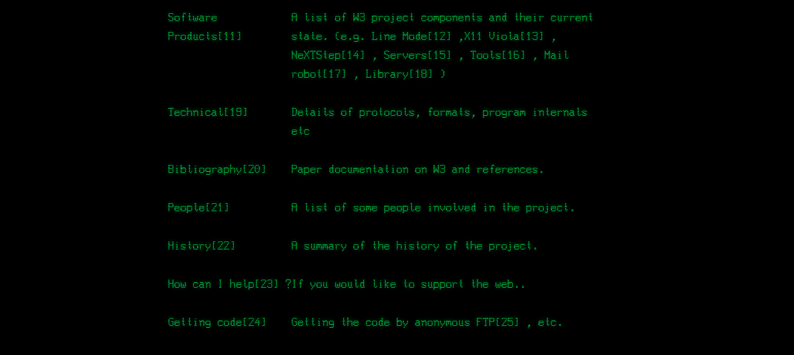
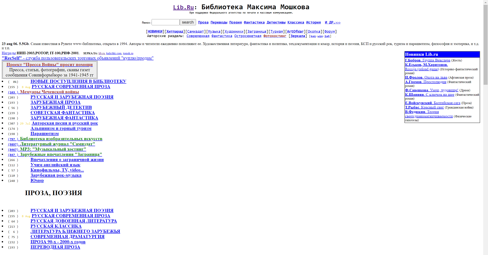
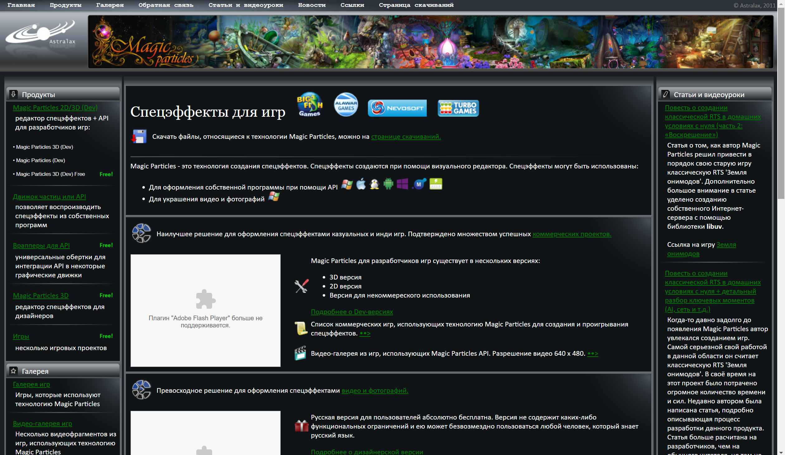

## Вот это да, мы умеем писать сайты?

На предыдущих занятиях мы получили базовое представление об устройстве внешней части web-приложения (front-а).
Добавить кнопку, текст и другие элементы на сайтик не проблема:

```html
<!DOCTYPE html>
<html lang="en">
<head>
    <title>Title</title>
</head>
<body>
<div class="main-block">
    <h3>Ваш средний балл:</h3>
    <h1>1.00</h1>
    <button>
        Повысить
    </button>
</div>
</body>
</html>
```

Вроде бы все отлично, но что произойдёт, если пользователь, захочет нажать на кнопку? Ничего, возникает нешуточная
проблема, как описать действия на нашей странице (например, при нажатии на кнопку увеличить средний балл на 0,01)

## Немного истории

### Что было раньше соц. сеть или веб-сайт?

Если говорить о сайте как о языке общения с пользователем, то возникает вопрос о его происхождении.
На заре становления Интернета (когда его использовали лишь военные и ученые) как такого понятия сайт (веб-сайт, website)
не было. Тогда сети нужны были в основном для обеспечения связи.

> Первая концепция Интернета была создана для нужд 
вооруженных сил США. Такая сеть должна была пережить Третью мировую войну и обеспечить бесперебойную связь между 
удаленными командными центрами и частями. 
<br> <br>
В далеком 1969 была создана ARPANET — академическая сеть, объединившая университеты. Затем следовало развитие USENET,
который соединил два академических центра, но имел первые дискуссионные группы. И это было достижение — сеть перестала
быть «практичной», превратившись в платформу для общения.

### console.log('Hello, HTML!')

Первые сайты были созданы в 1990 в рамках проекта Европейской организации ядерных исследований - WorldWideWeb (первый
web браузер). Результат этого детища двух ученых Тима Бернерса-Ли и Роберта Кайовы вы можете отыскать и по сегодняшний
день: 

http://info.cern.ch/hypertext/WWW/TheProject.html

Тим Бернерс-Ли очень крутой мужик, помимо World Wide Web (придумано совместно с Робертом Кайо. Не путать с
браузером WorldWideWeb), он придумал  URI, URL, HTTP (расскажет мой коллега Матвей Вадимович), **HTML**
 
> World Wide Web (всемирная паутина) — распределённая система, предоставляющая доступ к связанным между собой
документам, расположенным на различных компьютерах, подключённых к сети Интернет.

HTML был презентован Бернерсом-Ли в январе 1991 года. 

Я думаю на этом моменте стоит остановиться поподробнее, а именно почему весь интернет построен на HTML, почему нет 
альтернативы? Любой язык, технология, концепция не возникают на пустом месте. Например, Java был разработан для 
программирования бытовых электронных устройств. Python как скриптовый язык операционной системы Amoeba. HTML неразрывно
связан с WWW (World Wide Web). А так как все приняли всемирную паутину Бернерс-Ли и Роберта Кайо, то и обще стандартный
язык гипертекстовой разметки (HyperText Markup Language, HTML) стал неотъемлемой часть всего веба.

### Web 1.0

Первобытный сайт, детище первобытных программистов:



Обычно, чтобы дать представление о вебе с момента его рождения, середины 90-ых, по середину 00-ых советуют почитать о 
****Web 1.0****. Что это такое? Просто удобный термин, объединяющий основные концепции и технологии, массово 
применявшиеся в тот период. Стоит понимать, что сам термин появился постфактум.

##### Примеры: 

http://lib.ru/



https://www.astralax.ru/links



Функциональность:

- Статичные страницы.
- Гостевые книги, форумы или чаты.

# TODO

Сайты не были богаты функционалом, в основном 


Технологии:

- Содержимое сервер получал из файловой системы, а не из базы данных, зачастую никак не преобразовывая.
- Бедная гипертекстовая разметка.
- Использование специфичных тегов HTML.
- Указание конкретного разрешения монитора, при котором дизайн сайта отображается корректно
(не вылезает за пределы страницы, не разъезжается форматирование).
- Крайне редкое и непопулярное использование стилей CSS при оформлении страниц сайта.

Дизайнерские решения:

- Кнопки (баннеры) формата GIF, обычно 88×31 пикселей, в качестве указания поддерживаемых браузеров.
- Использование ярких цветов и материальных текстур (дерева, мрамора и прочих).
- Широкое использование анимированного GIF.

### Дв здравствует JS.

