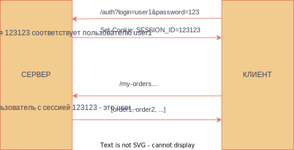

### Хедеры

Как и вся остальная информация о запросе, хедеры лежат в `request`

```python
@app.route('/h')
def h():
	request.headers.get('your-header-name')
	# можно вывести все
	print(dict(request.headers))
```

Устанавливать хедеры вручную при ответе можно с помощью [make_response](https://pythonru.com/uroki/5-otvet-servera-i-perehvat-zaprosov-vo-flask)
```python
@app.route('/books/<genre>') 
def books(genre): 
	res = make_response("All Books in {} category".format(genre)) 
	res.headers['Content-Type'] = 'text/plain'
	res.headers['Server'] = 'Foobar'
	return res
```
### Куки
https://habr.com/ru/companies/avito/articles/710674/
Давайте посмотрим на хедеры какого-нибудь запроса, а, точнее, на хедеры ответа на этот запрос. Здесь нас должен заинтересовать хедер Set-Cookie

**Куки** используются для сохранения информации между запросами. С их помощью можно, например, запомнить пользовательские настройки, данные для авторизации (об этом позже) или идентифицировать пользователя

В чём преимущество `Set-Cookie` перед любым другим хедером? Или почему бы вообще не передавать куки в теле запроса? Ответ - браузер сам будет следить за куками, так что при написании фронтенда нам не нужно будет об этом думать
При получении хедера `Set-Cookie` в ответе браузер сам запомнит значение куки, когда её нужно удалить и к запросам на какие адреса её нужно прикреплять.
И действительно, если посмотреть на хедеры запроса, отправленного после получения куки, мы увидим полученное ранее значение:


Хотя сами мы для этого ничего не сделали

Посмотреть, как и какие куки запомнил браузер можно тут:

#### Вот как это выглядит во фласке:
https://docs-python.ru/packages/veb-frejmvork-flask-python/rabota-cookie-prilozhenii-flask/
```python
from flask import Flask, request, make_response
# ...

@app.route('/cookie1')
def cookie1():
	print(request.cookie)
	# так можно достать куки из запроса

@app.route('/cookie2')
def cookie2():
	res = make_response("test") # Эта функция позволяет сформировать объект ответа вручную
	# Если её не вызывать, фласк вызовет её за вас, и передат туда то, что вернула функция,
	# обрабатывающая запрос
	res.set_cookie('cookie-name', 'some-value')
	return res
```

### Сессии
**Сессия** - это в первую очередь интуитивное понятие, концепция. Синонимами могут быть сеанс, "одно посещение сайта". Механизм, позволяющий в рамках множества запросов понимать, какие из них пришли от какого пользователя. 
Если говорить конкретнее, с точки зрения реализации, **сессия** - это специальная кука (часто просто случайно сгенерированная последовательность символов), которая выдаётся пользователю при авторизации на какое-то время. Так как это кука, браузер будет прикреплять её ко всем последующим запросам от этого пользователя (пока время жизни сессии не истечет). Получая эту куку, сервер может понять, от какого пользователя пришёл запрос.

Процесс выглядит примерно так:


Во фласке этот механизм уже реализован за нас:
https://docs-python.ru/packages/veb-frejmvork-flask-python/klass-sessions-modulja-flask/

```python
from flask import session, request

# установим секретный ключ для подписи. Держите это в секрете!
app.secret_key = b'_5#y2L"F4Q8z\n\xec]/'

@app.route('/')
def index():
    if 'username' in session:
        return f'Вошел как {session["username"]}'
    return 'Вы не авторизованы'

@app.route('/login', methods=['GET'])
def login():
    # устанавливаем сессию для пользователя
    session['username'] = request.args.get('username')
    return "Установили сессию"

@app.route('/logout')
def logout():
    # удаляем имя пользователя из сеанса, если оно есть
    session.pop('username', None)
    return "Удалили сессию"
```

Обратите внимание, что мы нигде ничего не генерируем, ну запоминаем и не ищем. Объект `session` хранить информацию, связанную с конкретным запросом (как и `request`)
### CORS, XSS, Безопасность
В ближайшем будущем у вас будет уникальная возможность познакомиться с разными очень неприятными ошибками вроде ошибки CORS запроса, непонятно куда исчезнувшей сессией или невозможностью получить из javascript'а какой-нибудь хедер. Чтобы хоть чуть чуть облегчить страдания, предлагаю разобраться, зачем вообще всё это было изобретено (не чтобы усложнить вам жизнь, честное слово)

Зачем придумали CORS https://habr.com/ru/companies/macloud/articles/553826/


### Задания
- Создайте сервер, который
	- Обрабатывает запрос на '/auth', прикрепляя к ответу хедер "Set-Authorisation" с секретным значением (под секретным значением я подразумеваю любую захардкоженную строку).
	- Обрабатывает запрос на '/get-data', только если в нём есть хедер "Authorization", со  значением из прошлого пункта, иначе кидает 401. Возвращать можно что угодно
- Создайте сервер, который
	- Обрабатывает запрос на '/auth', прикрепляя к ответу куку 'my-cookie' - случайно сгенерированную строчку (для генерации предлагаю использовать [это](https://stackoverflow.com/questions/976577/random-hash-in-python))
	- Обрабатывает запрос на '/get-data', возвращает количество посещений этой страницы пользователем (идентифицировать его нужно по выданной куке. Если куки нет - 401)
- Перепишите предыдущее задание с использованием фласковских сессий
- Модифицируйте задание с прошлого занятия: создайте приложение, умеющее создавать пользователей с ролями (и сохранять их в памяти или в файле, пока мы не умеем работать с базами данных), и умеющее проверять, есть ли у пользователя право совершать определённый запрос:
	- post `/create_user` -> принимает json с полями 'username', 'password', 'role'. Поддерживаются роли 'GUEST' и 'ADMIN'. для некорректных данных верните ошибку 400. Хранить нужно не пароль в чистом виде, а [хеш](https://www.tutorialspoint.com/how-to-hash-passwords-in-python) от него 
	- get `role` -> принимает логин, возвращает роль пользователя. Если такого пользователя нет, возвращает 404 
	- post `auth`, принимает логин и хеш от пароля, **не сам пароль**, выдает сессию, если пользователь с указанным логином и паролем существует. Если логин или пароль неверный - 403
	- get `users` -> Доступно только авторизованным пользователям (иначе 401), имеющим роль 'ADMIN' (иначе 403), возвращает список всех пользователей с ролями и паролями. 